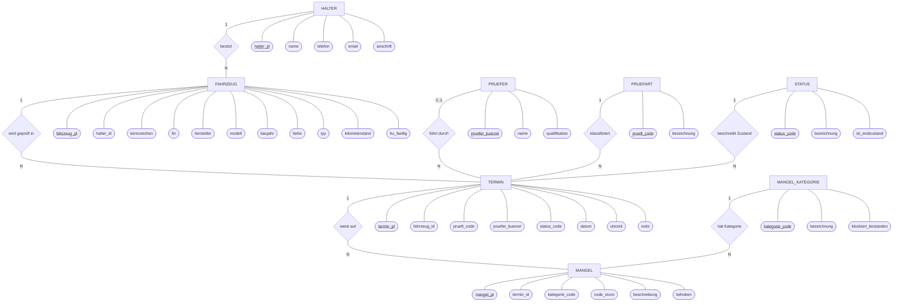

# Datenmodell - TÜV Prüfstelle Pro

**Vollständiger Drei-Schichten-Entwurf** nach klassischer Datenbank-Methodik
(Codd 1970, Chen 1976, Date 2003):

1. **Konzeptuelles Modell** - Entity-Relationship-Diagramm, frei von
   Implementierungsdetails
2. **Logisches Modell** - Relationenschema in 3. Normalform (3NF), Schlüssel
   und referentielle Integrität, aber ohne Indizes oder API-Code
3. **Physisches Modell** - konkrete MariaDB-Umsetzung mit Datentypen, Indizes,
   Constraints und initialen Stammdaten

Diese Trennung stellt sicher, dass Geschäftsanforderungen unabhängig von der
konkreten Implementierung diskutierbar bleiben. Die aktuelle Implementierung
nutzt MariaDB über die Express-API in `server/index.js`.

---

## 1. Konzeptuelles Modell - Entity-Relationship-Diagramm

Das Diagramm zeigt das fachliche Modell im Chen-Stil: Entitäten sind als
Rechtecke dargestellt, Beziehungen als Rauten und Attribute als Ovale. Die
Primärschlüssel sind wie in der klassischen Chen-Notation unterstrichen. Die
Fremdschlüssel werden erst im logischen Relationenschema eindeutig ausgewiesen,
weil sie aus den Beziehungen des ER-Modells abgeleitet werden.

### 1.1 ER-Diagramm (Chen-Notation, kompakt als Mermaid)



Legende: Rechteck = Entität, Raute = Beziehung, Oval = Attribut,
unterstrichenes Attribut = Primärschlüssel. Fremdschlüssel sind als normale
Attribute dargestellt und im logischen Modell darunter eindeutig ausgewiesen.
Die Kardinalitäten stehen direkt an den Verbindungslinien (`1`, `0..1` bzw.
`N`).

### 1.2 Entitäten und ihre Bedeutung

| Entität | Reale Bedeutung |
|---|---|
| **HALTER** | Eigentümer eines oder mehrerer Fahrzeuge - natürliche oder juristische Person |
| **FAHRZEUG** | Eindeutiges Kraftfahrzeug, identifiziert durch Kennzeichen und/oder FIN |
| **TERMIN** | Konkreter Prüfungs-Termin eines Fahrzeugs zu einem Zeitpunkt |
| **MANGEL** | Festgestellte Beanstandung bei einer Prüfung gemäß StVZO Anlage VIII |
| **PRUEFER** | Sachverständiger Prüfingenieur, der den Termin durchführt |
| **PRUEFART** | Klassifikation der Prüfung (HU, AU, HU+AU, Nachprüfung, ...) |
| **STATUS** | Zustand eines Termins im Workflow |
| **MANGEL_KATEGORIE** | Einstufung eines Mangels (OM, GM, EM, GfM) inklusive Wirkung auf das Prüfergebnis |

### 1.3 Beziehungen und Kardinalitäten

| Beziehung | Kardinalität | Erläuterung |
|---|---|---|
| HALTER **besitzt** FAHRZEUG | 1 : N | Ein Halter kann mehrere Fahrzeuge besitzen; jedes Fahrzeug gehört zu genau einem Halter |
| FAHRZEUG **wird geprüft in** TERMIN | 1 : N | Ein Fahrzeug hat im Laufe der Zeit beliebig viele Termine; jeder Termin gilt genau einem Fahrzeug |
| TERMIN **weist auf** MANGEL | 1 : N | Ein Termin kann mehrere Mängel haben; jeder Mangel ist genau einem Termin zugeordnet |
| PRUEFER **führt durch** TERMIN | 0..1 : N | Ein Prüfer kann viele Termine durchführen; ein Termin kann noch ohne zugewiesenen Prüfer geplant sein |
| PRUEFART **klassifiziert** TERMIN | 1 : N | Jeder Termin ist genau einer Prüfart zugeordnet |
| STATUS **beschreibt Zustand** TERMIN | 1 : N | Jeder Termin hat zu einem Zeitpunkt genau einen Status |
| MANGEL_KATEGORIE **hat Kategorie** MANGEL | 1 : N | Jede Kategorie kann bei vielen Mängeln vorkommen; jeder Mangel hat genau eine Kategorie |

### 1.4 Geschäftsregeln auf konzeptueller Ebene

Diese Regeln stellen das Geschäftswissen dar, unabhängig davon, wie sie später
technisch erzwungen werden.

| ID | Regel | Quelle |
|---|---|---|
| GR-01 | Jedes Fahrzeug ist über sein Kennzeichen eindeutig identifizierbar | KBA / StVZO |
| GR-02 | Wenn eine Fahrgestellnummer (FIN) angegeben ist, ist sie weltweit eindeutig | ISO 3779 |
| GR-03 | Ein Termin mit erheblichem oder gefährlichem Mangel darf nicht den Status `Bestanden` haben | § 29 StVZO |
| GR-04 | Baujahr eines Fahrzeugs liegt zwischen 1885 und 2100 | Plausibilität / MariaDB-Constraint |
| GR-05 | Kilometerstand ist nichtnegativ und unter einer Plausibilitätsgrenze von 3.000.000 km | Plausibilität |
| GR-06 | Beim Löschen eines Fahrzeugs werden alle zugehörigen Termine und Mängel kaskadierend entfernt | Domänen-Konsistenz |

---

## 2. Logisches Modell - Relationenschema in 3NF

Das logische Modell überführt das konzeptuelle ER-Diagramm in normalisierte
Relationen. Ziel ist die dritte Normalform (3NF), damit Insert-, Update- und
Delete-Anomalien vermieden werden.

### 2.1 Schritte der Normalisierung

Aus dem konzeptuellen Modell ergibt sich zunächst eine naive Fahrzeugstruktur:

```text
FAHRZEUG_KONZEPT = { kennzeichen, fin, hersteller, modell, baujahr,
                    farbe, typ, kilometerstand, hu_faellig,
                    halter_name, halter_telefon, halter_email,
                    halter_anschrift }
```

**1NF:** Alle Attribute sind atomar. Mehrwertige Mängel-Arrays werden nicht im
Termin gespeichert, sondern in eine eigene Relation `MANGEL` ausgelagert.

**2NF:** Keine partielle funktionale Abhängigkeit vom Schlüssel. Die Relationen
nutzen einspaltige Primärschlüssel.

**3NF:** Keine transitiven Abhängigkeiten. Halterdaten werden aus `FAHRZEUG`
entfernt und in `HALTER` gespeichert:

```text
HALTER = { halter_id, name, telefon, email, anschrift }
FAHRZEUG = { fahrzeug_id, kennzeichen, fin, hersteller, modell, baujahr,
            farbe, typ, kilometerstand, hu_faellig, halter_id }
```

Analog wird `MANGEL` als eigene Relation mit Fremdschlüssel auf `TERMIN`
modelliert.

### 2.2 Endgültiges Relationenschema (3NF)

Notation: `RELATION(Primärschlüssel, Attribute, fremdschlüssel↗ZIEL)`

```text
HALTER(halter_id, name, telefon, email, anschrift, erfasst_am)

FAHRZEUG(fahrzeug_id, kennzeichen, fin?, hersteller, modell, baujahr?, farbe?,
        typ, kilometerstand?, hu_faellig?, halter_id↗HALTER, erfasst_am)

PRUEFART(prueft_code, bezeichnung)

PRUEFER(pruefer_kuerzel, name, qualifikation?)

STATUS(status_code, bezeichnung, ist_endzustand)

TERMIN(termin_id, fahrzeug_id↗FAHRZEUG, datum, uhrzeit?, prueft_code↗PRUEFART,
      pruefer_kuerzel?↗PRUEFER, status_code↗STATUS, notiz?, erfasst_am)

MANGEL_KATEGORIE(kategorie_code, bezeichnung, blockiert_bestanden)

MANGEL(mangel_id, termin_id↗TERMIN, code_stvzo?, beschreibung,
      kategorie_code↗MANGEL_KATEGORIE, behoben, erfasst_am)
```

**Legende:**

- `?` = nullable
- `↗ZIEL` = Fremdschlüssel referenziert Zielrelation
- `STATUS.ist_endzustand` markiert terminale Status
- `MANGEL_KATEGORIE.blockiert_bestanden` löst WF-01 aus, wenn `true`

### 2.3 Schlüssel und Eindeutigkeitsbedingungen

| Relation | Primärschlüssel | Unique-Constraints |
|---|---|---|
| HALTER | `halter_id` | `email`, falls vorhanden |
| FAHRZEUG | `fahrzeug_id` | `kennzeichen`; `fin`, falls vorhanden |
| PRUEFART | `prueft_code` | - |
| PRUEFER | `pruefer_kuerzel` | - |
| STATUS | `status_code` | - |
| TERMIN | `termin_id` | `(fahrzeug_id, datum, uhrzeit)` |
| MANGEL_KATEGORIE | `kategorie_code` | - |
| MANGEL | `mangel_id` | - |

### 2.4 Referentielle Integrität

| Fremdschlüssel | Referenziert | ON DELETE | ON UPDATE | Begründung |
|---|---|---|---|---|
| `FAHRZEUG.halter_id` | `HALTER.halter_id` | RESTRICT | CASCADE | Ein Halter mit Fahrzeugen darf nicht gelöscht werden |
| `TERMIN.fahrzeug_id` | `FAHRZEUG.fahrzeug_id` | CASCADE | CASCADE | Wird ein Fahrzeug gelöscht, gehen alle Termine mit |
| `TERMIN.prueft_code` | `PRUEFART.prueft_code` | RESTRICT | CASCADE | Prüfarten dürfen nicht gelöscht werden, solange sie referenziert werden |
| `TERMIN.pruefer_kuerzel` | `PRUEFER.pruefer_kuerzel` | SET NULL | CASCADE | Termine bleiben bestehen, wenn ein Prüfer entfernt wird |
| `TERMIN.status_code` | `STATUS.status_code` | RESTRICT | CASCADE | Statuswerte sind Domänenkonstanten |
| `MANGEL.termin_id` | `TERMIN.termin_id` | CASCADE | CASCADE | Wird ein Termin gelöscht, gehen die Mängel mit |
| `MANGEL.kategorie_code` | `MANGEL_KATEGORIE.kategorie_code` | RESTRICT | CASCADE | Kategorien sind Domänenkonstanten |

### 2.5 Geschäftsregeln im logischen Modell

| Regel | Logische Ausdrucksform | Erzwingung |
|---|---|---|
| GR-01 Kennzeichen-Eindeutigkeit | `UNIQUE(kennzeichen)` auf FAHRZEUG | deklarativ |
| GR-02 FIN-Eindeutigkeit | `UNIQUE(fin)`; mehrere `NULL` sind in MariaDB erlaubt | deklarativ |
| GR-03 WF-01 - Bestanden trotz EM/GfM verhindern | relationsübergreifend, nicht als einfacher CHECK ausdrückbar | UI + Express-API + MariaDB-Trigger (`trg_termin_wf01_update`) |
| GR-04 Baujahr-Plausibilität | `CHECK (baujahr IS NULL OR baujahr BETWEEN 1885 AND 2100)` | deklarativ |
| GR-05 Kilometerstand-Plausibilität | `CHECK (kilometerstand IS NULL OR kilometerstand BETWEEN 0 AND 3000000)` | deklarativ |
| GR-06 Cascade beim Fahrzeug-Löschen | `ON DELETE CASCADE` an `TERMIN.fahrzeug_id` und `MANGEL.termin_id` | deklarativ |

---

## 3. Physisches Modell - MariaDB-Implementierung

Dieses Kapitel beschreibt die konkrete Realisierung in MariaDB. Die technische
Quelle ist `server/db.js`; die Express-API ruft beim Start `ensureDatabase()`
auf und erstellt Datenbank, Tabellen und Stammdaten idempotent.

### 3.1 DDL - Tabellen-Definitionen

```sql
CREATE TABLE halter (
  halter_id   CHAR(36) PRIMARY KEY,
  name        VARCHAR(160) NOT NULL,
  telefon     VARCHAR(80),
  email       VARCHAR(160),
  anschrift   TEXT,
  erfasst_am  DATETIME NOT NULL DEFAULT CURRENT_TIMESTAMP,
  UNIQUE KEY halter_email_unique (email),
  KEY halter_name_idx (name)
) ENGINE=InnoDB DEFAULT CHARSET=utf8mb4 COLLATE=utf8mb4_unicode_ci;

CREATE TABLE fahrzeug (
  fahrzeug_id     CHAR(36) PRIMARY KEY,
  kennzeichen     VARCHAR(32) NOT NULL,
  fin             VARCHAR(32),
  hersteller      VARCHAR(120) NOT NULL,
  modell          VARCHAR(120) NOT NULL,
  baujahr         INT,
  farbe           VARCHAR(80),
  typ             VARCHAR(80) NOT NULL,
  kilometerstand  INT,
  hu_faellig      DATE,
  halter_id       CHAR(36) NOT NULL,
  erfasst_am      DATETIME NOT NULL DEFAULT CURRENT_TIMESTAMP,
  UNIQUE KEY fahrzeug_kennzeichen_unique (kennzeichen),
  UNIQUE KEY fahrzeug_fin_unique (fin),
  KEY fahrzeug_hu_idx (hu_faellig),
  KEY fahrzeug_halter_idx (halter_id),
  CONSTRAINT fahrzeug_halter_fk
    FOREIGN KEY (halter_id) REFERENCES halter(halter_id)
    ON DELETE RESTRICT ON UPDATE CASCADE,
  CONSTRAINT fahrzeug_baujahr_check
    CHECK (baujahr IS NULL OR (baujahr BETWEEN 1885 AND 2100)),
  CONSTRAINT fahrzeug_km_check
    CHECK (kilometerstand IS NULL OR (kilometerstand BETWEEN 0 AND 3000000))
) ENGINE=InnoDB DEFAULT CHARSET=utf8mb4 COLLATE=utf8mb4_unicode_ci;

CREATE TABLE pruefart (
  prueft_code VARCHAR(40) PRIMARY KEY,
  bezeichnung VARCHAR(120) NOT NULL
) ENGINE=InnoDB DEFAULT CHARSET=utf8mb4 COLLATE=utf8mb4_unicode_ci;

CREATE TABLE pruefer (
  pruefer_kuerzel VARCHAR(20) PRIMARY KEY,
  name            VARCHAR(120) NOT NULL,
  qualifikation   VARCHAR(120)
) ENGINE=InnoDB DEFAULT CHARSET=utf8mb4 COLLATE=utf8mb4_unicode_ci;

CREATE TABLE status (
  status_code     VARCHAR(40) PRIMARY KEY,
  bezeichnung     VARCHAR(80) NOT NULL,
  ist_endzustand  BOOLEAN NOT NULL DEFAULT FALSE
) ENGINE=InnoDB DEFAULT CHARSET=utf8mb4 COLLATE=utf8mb4_unicode_ci;

CREATE TABLE termin (
  termin_id       CHAR(36) PRIMARY KEY,
  fahrzeug_id     CHAR(36) NOT NULL,
  datum           DATE NOT NULL,
  uhrzeit         TIME,
  prueft_code     VARCHAR(40) NOT NULL,
  pruefer_kuerzel VARCHAR(20),
  status_code     VARCHAR(40) NOT NULL DEFAULT 'Geplant',
  notiz           TEXT,
  erfasst_am      DATETIME NOT NULL DEFAULT CURRENT_TIMESTAMP,
  UNIQUE KEY termin_zeit_unique (fahrzeug_id, datum, uhrzeit),
  KEY termin_datum_idx (datum, uhrzeit),
  KEY termin_fahrzeug_idx (fahrzeug_id, datum),
  CONSTRAINT termin_fahrzeug_fk
    FOREIGN KEY (fahrzeug_id) REFERENCES fahrzeug(fahrzeug_id)
    ON DELETE CASCADE ON UPDATE CASCADE,
  CONSTRAINT termin_pruefart_fk
    FOREIGN KEY (prueft_code) REFERENCES pruefart(prueft_code)
    ON DELETE RESTRICT ON UPDATE CASCADE,
  CONSTRAINT termin_pruefer_fk
    FOREIGN KEY (pruefer_kuerzel) REFERENCES pruefer(pruefer_kuerzel)
    ON DELETE SET NULL ON UPDATE CASCADE,
  CONSTRAINT termin_status_fk
    FOREIGN KEY (status_code) REFERENCES status(status_code)
    ON DELETE RESTRICT ON UPDATE CASCADE
) ENGINE=InnoDB DEFAULT CHARSET=utf8mb4 COLLATE=utf8mb4_unicode_ci;

CREATE TABLE mangel_kategorie (
  kategorie_code      VARCHAR(20) PRIMARY KEY,
  bezeichnung         VARCHAR(120) NOT NULL,
  blockiert_bestanden BOOLEAN NOT NULL DEFAULT FALSE
) ENGINE=InnoDB DEFAULT CHARSET=utf8mb4 COLLATE=utf8mb4_unicode_ci;

CREATE TABLE mangel (
  mangel_id      CHAR(36) PRIMARY KEY,
  termin_id      CHAR(36) NOT NULL,
  code_stvzo     VARCHAR(40),
  beschreibung   TEXT NOT NULL,
  kategorie_code VARCHAR(20) NOT NULL,
  behoben        BOOLEAN NOT NULL DEFAULT FALSE,
  erfasst_am     DATETIME NOT NULL DEFAULT CURRENT_TIMESTAMP,
  KEY mangel_termin_idx (termin_id),
  KEY mangel_kategorie_idx (kategorie_code),
  CONSTRAINT mangel_termin_fk
    FOREIGN KEY (termin_id) REFERENCES termin(termin_id)
    ON DELETE CASCADE ON UPDATE CASCADE,
  CONSTRAINT mangel_kategorie_fk
    FOREIGN KEY (kategorie_code) REFERENCES mangel_kategorie(kategorie_code)
    ON DELETE RESTRICT ON UPDATE CASCADE
) ENGINE=InnoDB DEFAULT CHARSET=utf8mb4 COLLATE=utf8mb4_unicode_ci;
```

### 3.2 Indizes

| Index | Tabelle | Zweck |
|---|---|---|
| `halter_name_idx` | `halter` | Halter-Suche und Sortierung |
| `fahrzeug_hu_idx` | `fahrzeug` | HU-Fälligkeitsauswertung |
| `fahrzeug_halter_idx` | `fahrzeug` | Fahrzeuge eines Halters |
| `termin_datum_idx` | `termin` | Tagesplan nach Datum und Uhrzeit |
| `termin_fahrzeug_idx` | `termin` | Prüfhistorie eines Fahrzeugs |
| `mangel_termin_idx` | `mangel` | Mängel eines Termins |
| `mangel_kategorie_idx` | `mangel` | Statistik nach Mangelkategorie |

### 3.3 WF-01 in der MariaDB-Architektur

Die Regel "kein `Bestanden` bei erheblichem oder gefährlichem Mangel" (§ 29
StVZO) ist in drei Schichten implementiert (Defense in Depth, siehe ADR-003):

1. **Frontend-Guard:** Status-Controls verhindern die Auswahl, wenn ein
   blockierender Mangel bekannt ist.
2. **Express-API-Guard:** `PATCH /api/termine/:id/status` prüft in MariaDB per
   JOIN gegen `mangel_kategorie.blockiert_bestanden` (mit `m.behoben = FALSE`).
3. **DB-Trigger:** `trg_termin_wf01_update BEFORE UPDATE ON termin` wirft
   `SIGNAL SQLSTATE '45000'`, falls jemand die ersten zwei Schichten umgeht
   und direkt per SQL versucht, den Status auf `Bestanden` zu setzen.

Der zentrale API-Ausdruck ist:

```sql
SELECT COUNT(*) AS count
FROM mangel m
JOIN mangel_kategorie mk ON mk.kategorie_code = m.kategorie_code
WHERE m.termin_id = ?
  AND mk.blockiert_bestanden = TRUE
  AND m.behoben = FALSE;
```

Wenn ein blockierender Mangel zu einem bereits bestandenen Termin angelegt wird,
setzt die API den Termin automatisch auf `Nicht bestanden` zurück. Behobene
Mängel (`behoben = TRUE`) zählen nicht.

### 3.4 Initial-Daten

Die API lädt Stammdaten idempotent mit `INSERT IGNORE`.

```sql
INSERT IGNORE INTO status (status_code, bezeichnung, ist_endzustand) VALUES
  ('Geplant', 'Geplant', false),
  ('In Prüfung', 'In Prüfung', false),
  ('Bestanden', 'Bestanden', true),
  ('Nicht bestanden', 'Nicht bestanden', true),
  ('Nachprüfung', 'Nachprüfung', false),
  ('Nicht erschienen', 'Nicht erschienen', true),
  ('Abgebrochen', 'Abgebrochen', true);

INSERT IGNORE INTO mangel_kategorie
  (kategorie_code, bezeichnung, blockiert_bestanden)
VALUES
  ('OM',  'Ohne Mangel',         false),
  ('GM',  'Geringer Mangel',     false),
  ('EM',  'Erheblicher Mangel',  true),
  ('GfM', 'Gefährlicher Mangel', true);
```

Die Kategorien folgen der **HU-Richtlinie nach § 29 StVZO Anlage VIII Nr. 3**.
Frühere Versionen des Schemas verwendeten zusätzliche Codes (`LM`, `HM`) mit
abweichender `blockiert_bestanden`-Belegung; diese sind durch
`migrateCategories()` in `server/db.js` per `ON UPDATE CASCADE` migriert worden
(siehe ADR-003).

### 3.5 Beispielabfragen

Tagesplan mit Fahrzeug und Halter:

```sql
SELECT
  t.datum,
  t.uhrzeit,
  f.kennzeichen,
  f.hersteller,
  f.modell,
  h.name AS halter,
  t.status_code
FROM termin t
JOIN fahrzeug f ON f.fahrzeug_id = t.fahrzeug_id
JOIN halter h ON h.halter_id = f.halter_id
WHERE t.datum = ?
ORDER BY t.uhrzeit;
```

Mängelstatistik:

```sql
SELECT
  mk.kategorie_code,
  mk.bezeichnung,
  COUNT(*) AS anzahl
FROM mangel m
JOIN mangel_kategorie mk ON mk.kategorie_code = m.kategorie_code
GROUP BY mk.kategorie_code, mk.bezeichnung
ORDER BY anzahl DESC;
```

---

## 4. Vergleich: konzeptuell vs. logisch vs. physisch

| Aspekt | Konzeptuell | Logisch | Physisch |
|---|---|---|---|
| Entitäten / Beziehungen | ja | - | - |
| Attribute fachlich | ja | - | - |
| Geschäftsregeln textuell | ja | ja | ja |
| Relationen / Schlüssel | - | ja | ja |
| Normalisierung 3NF | - | ja | - |
| Referentielle Integrität | - | ja | ja |
| CHECK-Constraints | - | ja | ja |
| MariaDB-Datentypen | - | teilweise | ja |
| Indizes | - | - | ja |
| API-Endpunkte | - | - | ja |
| Tabellen-Engine / Charset | - | - | ja |

---

## 5. Warum MariaDB?

| Aspekt | Vorteil im Projekt |
|---|---|
| Relationale Daten | passt zu Halter, Fahrzeug, Termin und Mangel |
| Referentielle Integrität | MariaDB erzwingt Fremdschlüssel und Cascades |
| Zentrale Persistenz | mehrere Browser/Clients nutzen denselben Datenbestand |
| SQL-Auswertungen | Statistiken und Berichte lassen sich direkt aus Tabellen ableiten |
| Betrieb | lokal oder serverseitig ohne Cloud-Datenbank möglich |
| Sicherheit | Zugangsdaten bleiben im Backend und nicht im Frontend |

Die Browser-App spricht MariaDB nicht direkt an. Der Zugriff läuft über:

```text
React/Vite -> src/db/apiClient.ts -> Express API -> server/db.js -> MariaDB
```

---

## 6. Umgesetzte Migration auf MariaDB

| Phase | Inhalt | Status |
|---|---|---|
| 1 | MariaDB-Verbindung mit `mariadb` Node.js Driver | umgesetzt |
| 2 | Express-API unter `/api` | umgesetzt |
| 3 | Tabellen-Setup in `server/db.js` | umgesetzt |
| 4 | Stammdaten-Seed für Status, Prüfarten, Prüfer und Mangelkategorien | umgesetzt |
| 5 | Frontend-Zugriff über `src/db/apiClient.ts` | umgesetzt |
| 6 | `useDb.ts` auf API-Aufrufe umgestellt | umgesetzt |
| 7 | Dokumentation auf MariaDB aktualisiert | umgesetzt |

---

## 7. Änderungshistorie

| Version | Datum | Änderung |
|---|---|---|
| 1.0 | 2026-04-15 | Erste Sprint-1-Skizze |
| 2.0 | 2026-05-13 | Drei-Schichten-Modell mit ER, 3NF und physischem SQL-Modell |
| 3.0 | 2026-05-17 | Persistenz-Dokumentation auf MariaDB/Express umgestellt |
| 3.1 | 2026-05-17 | Entfernte Modelltabellen und Chen-ER-Diagramm wiederhergestellt |
