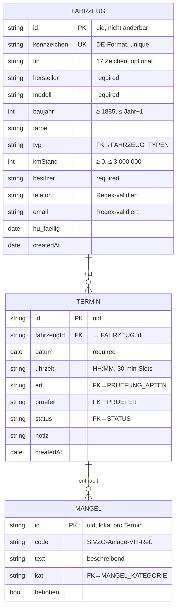

# Datenmodell — TÜV Prüfstelle Pro

Vollständige Beschreibung der Entitäten, Attribute, Integritätsbedingungen,
Indizes und der Diskussion NoSQL-vs-RDBMS.

---

## 1. Entity-Relationship-Diagramm



## 2. Warum diese Granularität?

**Warum `Fahrzeug` und `Termin` separate Entitäten?**
Ein Fahrzeug existiert unabhängig von seinen Prüfungen (auch nach Abschluss
aller Termine wird es nicht gelöscht). Ein Termin bezieht sich zwingend auf
genau ein Fahrzeug. Klassische 1:N-Beziehung mit eigenständigem Lebenszyklus je
Entität.

**Warum `Mangel` als Array innerhalb `Termin`, nicht als eigene Entität?**
Ein Mangel hat **keine eigenständige Existenz**: Er gehört immer zu genau einer
Prüfung, wird nur im Kontext der Prüfung angezeigt/bearbeitet und hat keine
Beziehungen zu anderen Entitäten außer seinem Termin. Die Frage "Welche Mängel
gibt es insgesamt?" wird in der Statistik über eine Aggregation gelöst
(`termine.flatMap(t => t.mängel)`), nicht über eine Select-Abfrage. In
Firestore ist das Einbetten daher idiomatisch und performanter als eine
Sub-Collection (1 Read statt N+1).

**Warum `besitzer`, `telefon`, `email` als Attribute des Fahrzeugs, nicht als
eigene Entität `Halter`?**
Aus Scope-Gründen: Die aktuelle Anwendung modelliert einen Halter pro Fahrzeug
und hat keinen Bedarf, mehrere Fahrzeuge eines Halters zu gruppieren oder
Halter-Adressdaten zu pflegen. **Für einen Produktivbetrieb wäre eine eigene
Entität `Halter` mit Normalisierung sinnvoll** (ein Halter kann mehrere
Fahrzeuge besitzen, ein Halter-Update würde dann nicht N Fahrzeuge berühren).
Diese Änderung wäre eine klassische 3NF-Normalisierung und ist im Ausblick
dokumentiert.

**Warum `art` (Prüfungsart) und `pruefer` als Referenzen (FK) auf
Konstanten-Listen statt auf Datenbank-Collections?**
Beide Listen sind Stammdaten mit < 15 Einträgen, ändern sich selten, und sind
stärker mit dem Code (Rechtsgrundlagen, Zertifizierungen) verknüpft als mit
Laufzeit-Daten. Eine Datenbank-Collection würde nur unnötige Komplexität
erzeugen ohne Nutzen.

## 3. Vollständige Attributliste

### 3.1 Entität `Fahrzeug`

| Attribut | Typ | Pflicht | Validierung | Beispiel |
|---|---|---|---|---|
| `id` | string (uid) | Y | generiert | `"lm5r2-hj9"` |
| `kennzeichen` | string | Y | Regex `^[A-ZÄÖÜ]{1,3}[-\s][A-Z]{1,2}\s?\d{1,4}[HE]?$`; global unique; normalisiert (Uppercase, Single-Space) | `"B-TK 1234"` |
| `fin` | string | N | 17 Zeichen, ohne `I`, `O`, `Q` (Regex `[A-HJ-NPR-Z0-9]{17}`) | `"WBA3A5C50CF256985"` |
| `hersteller` | string | Y | trim, nicht leer | `"BMW"` |
| `modell` | string | Y | trim, nicht leer | `"320d xDrive"` |
| `baujahr` | number | N | Integer, 1885 ≤ x ≤ aktuelles Jahr + 1 | `2018` |
| `farbe` | string | N | Freitext | `"Sophistograu Metallic"` |
| `typ` | string | Y | ∈ FAHRZEUG_TYPEN.id | `"PKW"` |
| `kmStand` | number | N | Integer, 0 ≤ x ≤ 3 000 000 | `87420` |
| `besitzer` | string | Y | trim, nicht leer | `"Klaus Müller"` |
| `telefon` | string | N | Regex `[+()\d\s\-/]{5,30}`, keine Buchstaben, ≥ 5 Ziffern | `"+49 176 1234567"` |
| `email` | string | N | Regex `^[^\s@]+@[^\s@]+\.[^\s@]{2,}$`, normalisiert (lowercase) | `"k.mueller@mail.de"` |
| `hu_faellig` | string (ISO-Datum) | N | gültiges Datum | `"2026-06-15"` |
| `createdAt` | string (ISO-Datum) | Y | automatisch gesetzt | `"2026-04-24"` |

### 3.2 Entität `Termin`

| Attribut | Typ | Pflicht | Validierung | Beispiel |
|---|---|---|---|---|
| `id` | string | Y | generiert | `"xt2-kl9nm"` |
| `fahrzeugId` | string (FK) | Y | muss existierendes Fahrzeug referenzieren | `"lm5r2-hj9"` |
| `datum` | string (ISO) | Y | gültiges Datum | `"2026-04-24"` |
| `uhrzeit` | string | N | ∈ TIME_SLOTS (30-Min-Raster 07:00–17:30) | `"08:00"` |
| `art` | string | N | ∈ PRUEFUNG_ARTEN.id | `"HU_AU"` |
| `pruefer` | string | N | ∈ PRUEFER.id | `"MW"` |
| `status` | string | Y | ∈ STATUS, Default `GEPLANT` | `"Bestanden"` |
| `notiz` | string | N | Freitext | `"Bremsflüssigkeit prüfen"` |
| `mängel` | Mangel[] | N | eingebettetes Array, Default `[]` | `[{...}]` |
| `createdAt` | string | Y | automatisch | `"2026-04-24"` |

### 3.3 Entität `Mangel` (eingebettet in `Termin.mängel`)

| Attribut | Typ | Pflicht | Validierung | Beispiel |
|---|---|---|---|---|
| `id` | string | Y | generiert | `"ab3-xy7"` |
| `code` | string | Y | typischerweise StVZO-Referenz, bei Freitext `"FR"` | `"2.1.1"` |
| `text` | string | Y | beschreibend | `"Betriebsbremse: Ungleichmäßige Bremswirkung"` |
| `kat` | string | Y | ∈ `{OM, LM, EM, HM, GM}` | `"HM"` |
| `behoben` | boolean | N | Default `false` | `false` |

## 4. Integritätsbedingungen (Business Rules)

Über reine Typ- und Format-Prüfungen hinaus gelten folgende Regeln:

### 4.1 Entitäts-Integrität

| Regel-ID | Beschreibung | Durchsetzung |
|---|---|---|
| INT-01 | `Fahrzeug.kennzeichen` ist global eindeutig (case/whitespace-insensitiv) | `validateKennzeichenUnique` vor Speichern; fehlt: Firestore-Unique-Index (geplant mit Security Rules, s. Ausblick) |
| INT-02 | `Fahrzeug.id`, `Termin.id`, `Mangel.id` sind stabil und unveränderlich | useStore.updFz/updTr verhindern ID-Änderung (Patches ohne `id`-Feld) |
| INT-03 | `Termin.fahrzeugId` muss auf existierendes Fahrzeug zeigen | aktuell nur über UI gewährleistet (Dropdown mit validierten Optionen); für Cloud-Betrieb: Security Rule oder Cloud Function |

### 4.2 Referentielle Integrität

| Regel-ID | Beschreibung | Durchsetzung |
|---|---|---|
| REF-01 | Löschen eines `Fahrzeug` löscht kaskadiert alle zugehörigen `Termin`e | `useStore.delFz` führt Batch-Delete durch |
| REF-02 | `Termin.art` muss in `PRUEFUNG_ARTEN` vorkommen | UI-Dropdown limitiert Auswahl |
| REF-03 | `Termin.pruefer` muss in `PRUEFER` vorkommen | UI-Dropdown limitiert Auswahl |

### 4.3 Workflow-Integrität

| Regel-ID | Beschreibung | Begründung | Durchsetzung |
|---|---|---|---|
| WF-01 | Ein `Termin` mit mindestens einem Mangel der Kategorie `HM` oder `GM` kann nicht den Status `BESTANDEN` haben | § 29 StVZO Anlage VIII: Hauptmängel und gefährliche Mängel begründen "nicht bestanden" bis zur Nachprüfung | 4 Durchsetzungsstellen (s. `design.md` Abschnitt 1.3): MaengelModal (Button disabled), TerminModal (Dropdown-Option disabled), TagesplanView.advance() (Auto-Route auf NICHT_BESTANDEN), useStore.updTr (Guard) |
| WF-02 | `Termin.status` darf nicht von `BESTANDEN`/`NICHT_BESTANDEN`/`NACHPRUEFUNG` zurück auf `GEPLANT` wechseln, außer bewusster Revert | Nicht explizit durchgesetzt — Akzeptanz für Korrekturfälle. In einer Produktivversion wäre ein Audit-Trail Pflicht (Ausblick) |
| WF-03 | Wird ein HM/GM-Mangel zu einem bereits `BESTANDEN`en Termin hinzugefügt, wird der Status automatisch auf `NICHT_BESTANDEN` zurückgesetzt | Datenintegrität wahrt sich selbst | `useStore.addMangel` Guard |

### 4.4 Wertebereichs-Integrität

Alle in 3.1–3.3 unter Spalte "Validierung" aufgeführten Format- und
Bereichsprüfungen sind in `src/utils/validators.js` implementiert und per
Vitest-Tests (`src/tests/utils/validators.test.js`) abgesichert.

## 5. Indizes

Firestore-Automatik: jeder einzelne Feldname bekommt einen Index automatisch.
Für zusammengesetzte Abfragen sind zusätzliche Indizes definierbar; im
Prototyp-Scope ist das nicht nötig, da alle Filter clientseitig laufen.

**Bei Skalierung (> ~10 000 Termine)** wären sinnvoll:

- `termine` — Index auf `datum ASC, uhrzeit ASC` (für Tagesplan-Sortierung)
- `termine` — Index auf `fahrzeugId ASC, datum DESC` (Prüfhistorie eines Fahrzeugs)
- `fahrzeuge` — Index auf `hu_faellig ASC` (Fälligkeits-Reports)

## 6. Diskussion: NoSQL (Firestore) vs. Relationale DB

Frau Fuchs hat im Feedback vom 24.04.2026 die Entscheidung für Firestore
kritisch hinterfragt. Die folgende Analyse nimmt die Kritik ernst.

### 6.1 Ihr Argument (korrekt zusammengefasst)

> "Dokumentenbasierte DB sind eher für semistrukturierte Daten geeignet. Bei
> dem TÜV-Verwaltungssystem hat man es dagegen mit strukturierten Daten zu tun
> (der TÜV-Bericht hat eine fest vorgegeben Struktur und auch wenn man als
> Feature noch eine Fotodokumentation hinzufügt, kann man das problemlos als
> BLOB-Feld oder auch einfach als Feld mit einer Url/Pfad der Fotos auf eine
> Foto-Repository realisieren)"

Dieses Argument ist **korrekt** — unser Datenmodell ist tatsächlich hochgradig
strukturiert, und eine relationale DB (PostgreSQL, MySQL) wäre eine legitime,
teilweise sogar bessere Wahl. Wir hätten das in der Präsentation gründlicher
begründen müssen.

### 6.2 Pro RDBMS (PostgreSQL)

| Aspekt | RDBMS-Vorteil |
|---|---|
| Strukturierte Daten, feste Relationen | Schema-Enforcement, bessere Integrität (Foreign Keys als DB-Constraint, nicht nur Code-Layer) |
| Reporting (Statistik-Auswertungen) | SQL-Aggregationen (`GROUP BY`, `HAVING`, Window Functions) sind für Kennzahlen optimiert |
| Transaktionen | ACID standardmäßig; Firestore Transaktionen sind begrenzter (max 500 Operationen) |
| Komplexere JOINs | Native SQL-JOINs vs. Firestore's Notwendigkeit zu Client-Side-JOINs oder Datendenormalisierung |
| Migration / Schema Evolution | Tools wie Flyway/Liquibase bewährt; bei Firestore nur per manuellen Migrationsskripten |
| Datenschutz / lokale Verwaltung | Leichter on-premise hostbar (z. B. Prüfstelle kann eigene Instanz im lokalen Netz betreiben) |

### 6.3 Pro Firestore (warum wir es gewählt haben)

| Aspekt | Firestore-Vorteil |
|---|---|
| Echtzeit-Synchronisation | `onSnapshot`-API out-of-the-box ohne Websocket-Server; mehrere Nutzer sehen Änderungen sofort |
| Serverloses Backend | Kein eigener Backend-Dienst nötig → reduziert Projektkomplexität für eine 2-Personen-Prototyp-Abgabe |
| Offline-Support | Eingebaute Offline-Persistence (in unserer Umsetzung zusätzlich LocalStorage) |
| Eingebettete Dokumente (`mängel` in `Termin`) | Weniger Reads in unserem Zugriffsmuster (Mangel wird nie alleine gelesen) |
| Skalierung out-of-the-box | Auto-Sharding, keine manuelle Replikation |
| Firebase-Ökosystem | Direkter Anschluss an Auth, Storage, Cloud Functions (für Ausbau) |

### 6.4 Bewertung im Projekt-Kontext

**Für den Prototyp**: Firestore ist eine **akzeptable, nicht optimale** Wahl.
Die Vorteile (Echtzeit, serverlos, Tauri-Integration über REST-SDK) überwiegen
die Nachteile in einem 2-Personen-Semester-Projekt.

**Für einen Produktivbetrieb**: Die Kritik der Dozentin trifft zu. Ab dem Punkt,
an dem realistische Anforderungen dazukommen (Multi-Tenancy, komplexe
Auswertungen, audit-trails, Reporting über Prüfstellen hinweg), wäre ein
Migration auf **PostgreSQL + Node/Go-Backend** mittelfristig sauberer:

- `Fahrzeug`, `Halter`, `Termin`, `Mangel` als normalisierte Tabellen (3NF)
- Foto-Storage separat (S3, MinIO, Firebase Storage) mit URL-Referenz am `Mangel`
- PostGIS-Extension falls Standort-Features hinzukommen (Prüfstellen-Karten)

**Konkreter Migrationspfad** (Ausblick):

1. Schema in SQL ableiten (siehe Entwurf unten)
2. Backend-Layer einziehen (z. B. tRPC, PostgREST, oder klassisches Express/NestJS)
3. React-Client umstellen von `firestore.onSnapshot` → Websocket oder
   SSE-basiertes Live-Update (z. B. Supabase Realtime)

### 6.5 Alternativer SQL-Entwurf

```sql
CREATE TABLE halter (
  id           UUID PRIMARY KEY,
  name         TEXT NOT NULL,
  telefon      TEXT,
  email        TEXT,
  created_at   TIMESTAMPTZ NOT NULL DEFAULT now()
);

CREATE TABLE fahrzeug (
  id           UUID PRIMARY KEY,
  kennzeichen  TEXT NOT NULL UNIQUE,
  fin          TEXT UNIQUE,
  hersteller   TEXT NOT NULL,
  modell       TEXT NOT NULL,
  baujahr      INTEGER CHECK (baujahr BETWEEN 1885 AND EXTRACT(YEAR FROM now())::int + 1),
  farbe        TEXT,
  typ          TEXT NOT NULL,
  km_stand     INTEGER CHECK (km_stand >= 0 AND km_stand <= 3000000),
  halter_id    UUID NOT NULL REFERENCES halter(id) ON DELETE RESTRICT,
  hu_faellig   DATE,
  created_at   TIMESTAMPTZ NOT NULL DEFAULT now()
);

CREATE INDEX idx_fahrzeug_hu ON fahrzeug(hu_faellig);

CREATE TABLE termin (
  id           UUID PRIMARY KEY,
  fahrzeug_id  UUID NOT NULL REFERENCES fahrzeug(id) ON DELETE CASCADE,
  datum        DATE NOT NULL,
  uhrzeit      TIME,
  art          TEXT NOT NULL,
  pruefer_id   TEXT NOT NULL,
  status       TEXT NOT NULL CHECK (status IN (
    'Geplant','In Prüfung','Bestanden','Nicht bestanden',
    'Nachprüfung','Nicht erschienen','Abgebrochen'
  )),
  notiz        TEXT,
  created_at   TIMESTAMPTZ NOT NULL DEFAULT now()
);

CREATE INDEX idx_termin_datum  ON termin(datum, uhrzeit);
CREATE INDEX idx_termin_fz     ON termin(fahrzeug_id, datum DESC);

CREATE TABLE mangel (
  id           UUID PRIMARY KEY,
  termin_id    UUID NOT NULL REFERENCES termin(id) ON DELETE CASCADE,
  code         TEXT NOT NULL,
  text         TEXT NOT NULL,
  kat          TEXT NOT NULL CHECK (kat IN ('OM','LM','EM','HM','GM')),
  behoben      BOOLEAN NOT NULL DEFAULT false,
  photo_url    TEXT   -- für die Foto-Dokumentation
);

-- Business Rule WF-01 als DB-Constraint:
CREATE OR REPLACE FUNCTION trg_termin_status_check()
RETURNS TRIGGER AS $$
BEGIN
  IF NEW.status = 'Bestanden' AND EXISTS (
    SELECT 1 FROM mangel WHERE termin_id = NEW.id AND kat IN ('HM','GM')
  ) THEN
    RAISE EXCEPTION 'Bestanden nicht möglich bei Hauptmangel';
  END IF;
  RETURN NEW;
END;
$$ LANGUAGE plpgsql;

CREATE TRIGGER termin_status_check
  BEFORE UPDATE OF status ON termin
  FOR EACH ROW EXECUTE FUNCTION trg_termin_status_check();
```

**Beobachtung:** Die Workflow-Regel WF-01, die wir heute auf 4 JavaScript-Ebenen
durchsetzen, wäre in PostgreSQL als ein einziger Trigger deklarativ und
bulletproof lösbar. Das ist ein konkretes Argument für RDBMS in diesem Kontext.

## 7. Änderungshistorie

| Version | Datum | Änderung |
|---|---|---|
| 1.0 | 2026-04-15 | Rudimentäre Skizze nur in der Präsentation |
| 1.1 | 2026-04-24 | Vollständige Attributlisten, Integritätsbedingungen explizit, Diskussion NoSQL vs. RDBMS aufgenommen (nach Feedback Fuchs), SQL-Gegenentwurf |
