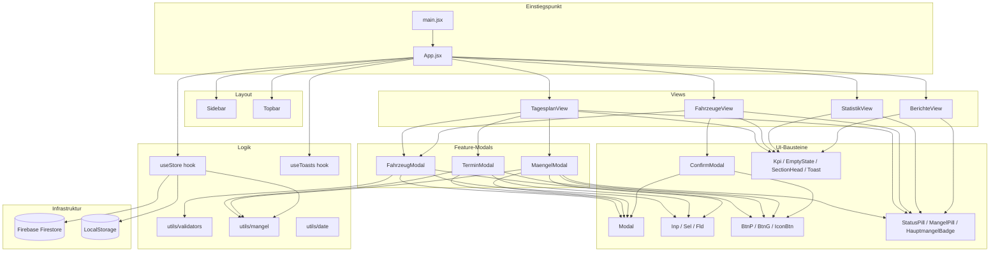
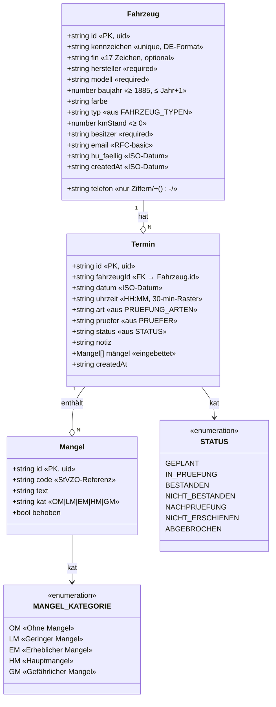
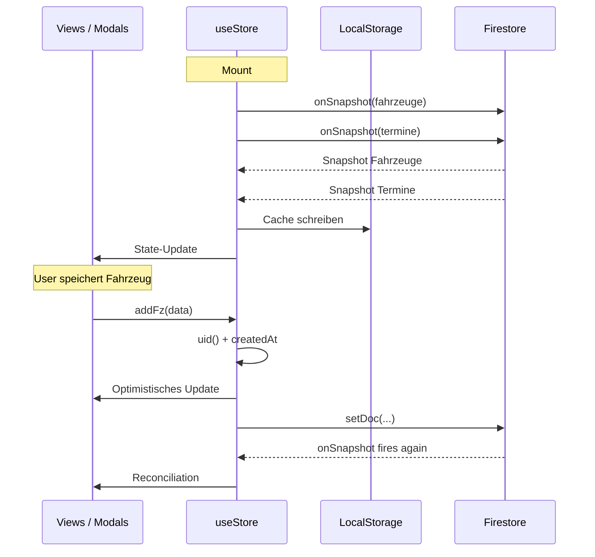
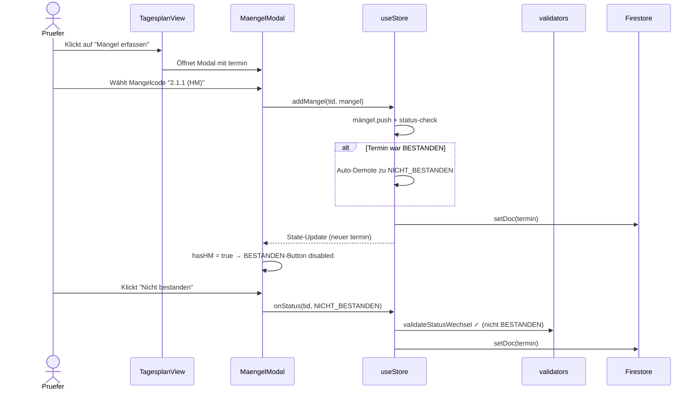

# Software-Design — TÜV Prüfstelle Pro

**Dokumentiert:** Architektur-Entscheidungen, Komponentenstruktur, Klassenmodell,
Datenfluss und Begründungen der gemachten Design-Entscheidungen.

---

## 1. Architekturüberblick

### 1.1 Layer-Struktur

```
┌─────────────────────────────────────────────────────────────┐
│                         PRÄSENTATION                         │
│  ┌──────────┐  ┌──────────┐  ┌──────────┐  ┌──────────┐    │
│  │Tagesplan │  │Fahrzeuge │  │Statistik │  │Berichte  │    │
│  │  View    │  │  View    │  │  View    │  │  View    │    │
│  └──────────┘  └──────────┘  └──────────┘  └──────────┘    │
│       │             │             │             │            │
│       └─────────────┴──────┬──────┴─────────────┘            │
│                            ▼                                 │
│                      ┌──────────┐                            │
│                      │  App.jsx │  Routing, Layout, State    │
│                      └──────────┘                            │
├─────────────────────────────────────────────────────────────┤
│                         LOGIK                                │
│     ┌──────────────┐      ┌────────────────┐                 │
│     │  useStore    │      │   useToasts    │                 │
│     │   Hook       │      │     Hook       │                 │
│     └──────────────┘      └────────────────┘                 │
│            │                                                 │
│            ▼                                                 │
│     ┌──────────────┐      ┌──────────────┐                   │
│     │  validators  │      │    mangel    │                   │
│     │  (utils)     │      │   (utils)    │                   │
│     └──────────────┘      └──────────────┘                   │
├─────────────────────────────────────────────────────────────┤
│                    INFRASTRUKTUR                             │
│      ┌───────────────────┐       ┌─────────────────┐         │
│      │ Firebase Firestore│       │  LocalStorage   │         │
│      │   (primär)        │       │  (Offline Cache)│         │
│      └───────────────────┘       └─────────────────┘         │
└─────────────────────────────────────────────────────────────┘
```

### 1.2 Technologie-Entscheidungen mit Begründung

| Entscheidung | Alternative(n) | Begründung |
|---|---|---|
| **React 19** mit Vite | Next.js, Remix | SPA ausreichend (kein SEO, keine Serverseitiges Rendering nötig); Vite bietet schnellsten DX mit HMR; React 19 bringt stabile `useOptimistic`/Actions — für künftige Auth-Integration hilfreich |
| **Tauri 2** (Rust) | Electron, PWA | Kompakte Binary (~6 MB vs. ~150 MB Electron), native Performance, Rust-Backend reduziert Angriffsfläche — für künftige lokale Hardware-Integration (OBD-Diagnose) kriticher als Electron |
| **Firestore (NoSQL)** | PostgreSQL + Node-Backend, Supabase | **Diese Entscheidung wurde von Frau Fuchs kritisch hinterfragt** — ausführliche Diskussion in `datenmodell.md` Abschnitt "NoSQL vs. RDBMS". Kurzfassung: Echtzeit-Sync out-of-the-box, serverloses Backend, realistisches Modell für eingebettete Mängel — ABER: bei wachsendem Reporting-Bedarf wäre RDBMS mittelfristig sauberer |
| **Recharts** | Chart.js, D3 | React-nativ, deklarativ, ausreichend für die 3–4 benötigten Chart-Typen |
| **Framer Motion** | CSS-only, react-spring | Deklarative Animationen direkt auf Komponenten; unterstützt `AnimatePresence` für Seitenübergänge |
| **Keine zentrale State-Management-Lib** (Redux/Zustand) | Redux Toolkit, Zustand | Bei ~20 Top-Level-Komponenten reicht `useStore`-Custom-Hook; kein Props-Drilling-Problem, das Redux rechtfertigen würde |
| **Inline-Styles + Tailwind-Resets** | CSS-Module, styled-components | Rapid Prototyping; Theme-Objekt `C` in `styles/theme.js` zentralisiert Farben; Tailwind wurde ursprünglich für Utility-Klassen eingebunden, hat sich in der Umsetzung aber auf globale Resets beschränkt |

### 1.3 Kern-Entwurfsprinzipien

1. **Single Responsibility** — jede Komponente hat genau eine Aufgabe. `Kpi.jsx`
   zeigt eine Kennzahl; `StatusPill.jsx` rendert genau einen Status als Pill.
2. **Composition over Configuration** — Views komponieren UI-Bausteine, statt
   sie über große Prop-Objekte zu konfigurieren.
3. **Custom Hooks isolieren Logik** — `useStore`, `useToasts` trennen
   Geschäftslogik/State-Management von UI-Komponenten.
4. **Shared Shapes** — `src/types/propTypes.js` enthält wiederverwendbare
   PropTypes-Definitionen (`FahrzeugShape`, `TerminShape`, `MangelShape`,
   `ToastShape`), damit Typ-Definitionen nicht dupliziert werden.
5. **Defense in Depth bei Business-Regeln** — Regel "kein BESTANDEN bei
   Hauptmangel" wird auf **vier** Ebenen durchgesetzt: UI-Button (disabled),
   Dropdown-Option (disabled), auto-advance-Funktion, Store-Guard. Beim Ausfall
   einer Ebene greifen die anderen.

## 2. Komponentendiagramm



**Wichtige Abhängigkeits-Regeln:**

- UI-Bausteine importieren **keine** Logik-Hooks — sie sind rein visuell
- Views importieren UI-Bausteine und Custom Hooks; keine direkten Firestore-Aufrufe
- `utils/*` enthält reine Funktionen (pure) ohne Seiteneffekte
- Infrastruktur-Zugriff nur über `useStore` — keine direkten `setDoc`-Aufrufe in Views

## 3. Klassendiagramm / Typen-Modell

JavaScript hat keine Klassen im traditionellen Sinne; das Datenmodell ist als
Objekt-Schema definiert. Die folgende UML-Notation zeigt die logischen
Entitäten und ihre Beziehungen.



### 3.1 Designentscheidungen am Modell

| Entscheidung | Begründung |
|---|---|
| **`Mangel` als eingebettetes Array in `Termin`** (nicht eigene Top-Level-Collection) | Mängel haben keine eigenständige Existenz — sie gehören immer zu genau einem Termin, werden immer im Kontext gelesen/geschrieben. Eingebettetes Modell spart Firestore-Reads (1 statt N+1). Wäre als JOIN in SQL unelegant, in Firestore idiomatisch |
| **`fahrzeugId` als Fremdschlüssel in `Termin`** | Klassische 1:N-Relation. Fahrzeug kann viele Termine haben, jeder Termin gehört zu genau einem Fahrzeug. Kein `terminIds`-Array im Fahrzeug, da die Richtung N→1 effizienter ist |
| **IDs als UUIDs (client-generiert via `uid()`)** | Ermöglicht optimistisches Update (Client erzeugt die ID vor dem Write, zeigt das neue Objekt sofort an) |
| **Status und Mangelkategorie als Enumerations in eigenen Konstanten-Modulen** | Zentrale Wahrheit; Änderungen an zulässigen Werten an einer Stelle |
| **`kmStand`, `baujahr` nullable** | Nicht jedes Fahrzeug hat bei Erstanlage alle Daten; Pflicht wären Kennzeichen + Hersteller/Modell + Halter |
| **`HU_FAELLIG` als ISO-Datum-String** (nicht Firestore `Timestamp`) | Vereinfacht Vergleiche und Sortierung; Firestore-Timestamps hätten Serialisierungs-Overhead |

## 4. State-Management: `useStore`



**Kernverantwortlichkeiten:**

- **Subscription-Management** für beide Collections (`fahrzeuge`, `termine`)
- **CRUD-API** für Components: `addFz`, `updFz`, `delFz`, `addTr`, `updTr`, `delTr`, `addMangel`, `delMangel`, `resetAll`
- **Business-Rule-Guard** in `updTr` und `addMangel` (Workflow-Regel BESTANDEN
  bei HM/GM ablehnen bzw. auto-demoten)
- **Offline-Fallback** via LocalStorage, falls Firestore-Verbindung scheitert
- **Seed-Daten** bei erster Nutzung (wenn beide Collections leer)

## 5. Datenfluss bei Mängelerfassung (Beispielszenario)



## 6. Fehler- und Eingabe-Validierung

Zwei Ebenen:

1. **Formular-Validierung** (hart, blockt Speichern): `validators.validateFahrzeug`,
   `validators.validateStatusWechsel` — Einzelfeldprüfungen nach Äquivalenzklassen
2. **Plausibilitäts-Warnungen** (weich, UI-Hinweis, nicht blockierend):
   `validators.checkHerstellerModellKonsistenz` — prüft gegen Referenzliste

Begründung der Trennung: Formularvalidierung schützt vor falschem Datentyp/
ungültigem Format. Plausibilität soll seltene Fälle (Oldtimer, Importe, Umbauten)
nicht blockieren, aber typische Fehler (BMW Polo, VW Golf als Motorrad) markieren.

## 7. Barrel-Exports

`src/components/ui/index.js` und `src/components/modal/index.js` bündeln die
Exporte, damit Views über `import { Inp, Sel, Fld } from "../components/ui"`
importieren statt jeden Pfad einzeln zu kennen. Nach Feedback evaluieren wir,
ob wir die Barrel-Exports komplett nutzen oder aus Tree-Shaking-Gründen
entfernen.
