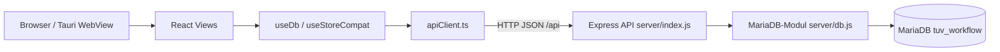
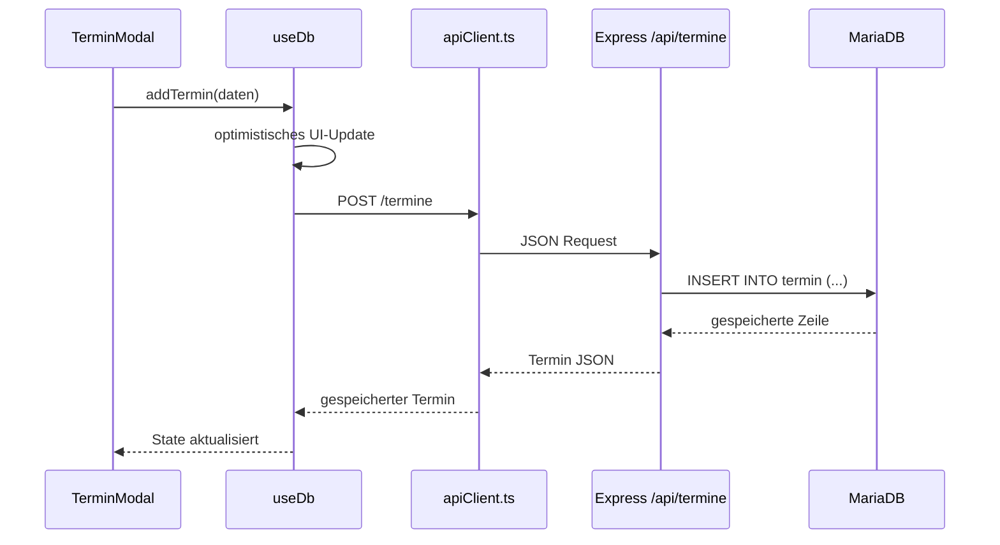

# Design-Dokumentation

Stand: 2026-05-17  
Aktuelle Architektur: React/Vite Frontend + Express API + MariaDB.

## 1. Zielbild

Die Anwendung trennt Benutzeroberflaeche, API und relationale Persistenz klar:



Der Browser enthaelt keine Datenbank-Engine. Alle dauerhaften Daten liegen in
MariaDB. Das Frontend bleibt dadurch leichtgewichtig und mehrere Clients koennen
denselben Datenstand nutzen.

## 2. Schichten

| Schicht | Dateien | Verantwortung |
|---|---|---|
| Praesentation | `src/views`, `src/features`, `src/components` | UI, Formulare, Tabellen, Modale, Charts |
| State/API-Client | `src/hooks/useDb.ts`, `src/hooks/useStoreCompat.ts`, `src/db/apiClient.ts` | React-State, optimistische Updates, HTTP-Aufrufe |
| Backend-API | `server/index.js` | REST-Endpunkte, Mapping camelCase/snake_case, Workflow-Regeln |
| Datenbank | `server/db.js`, MariaDB | Tabellen, Fremdschluessel, Constraints, Stammdaten |

## 3. Datenfluss

Beispiel: Termin anlegen.



Nach Schreiboperationen aktualisiert `useDb` bei Bedarf die Listen erneut. Damit
bleibt die UI konsistent, ohne dass die Views SQL oder Datenbankdetails kennen.

## 4. API-Schnittstelle

Die API liegt unter `/api`:

| Methode | Pfad | Zweck |
|---|---|---|
| GET | `/api/health` | API-/DB-Verfuegbarkeit pruefen |
| GET/POST/PATCH/DELETE | `/api/halter` | Halter verwalten |
| GET/POST/PATCH/DELETE | `/api/fahrzeuge` | Fahrzeuge verwalten |
| GET/POST/PATCH/DELETE | `/api/termine` | Termine verwalten |
| PATCH | `/api/termine/:id/status` | Status mit WF-01-Pruefung setzen |
| GET | `/api/termine/:id/maengel` | Maengel eines Termins laden |
| POST/DELETE | `/api/maengel` | Maengel anlegen und loeschen |
| POST | `/api/admin/reset` | Bewegungsdaten loeschen |
| POST | `/api/admin/demo` | Demo-Daten neu laden |

`vite.config.js` proxyt lokale Frontend-Aufrufe von `/api` an
`http://127.0.0.1:8787`.

## 5. Datenbankdesign

MariaDB speichert acht Tabellen:

- `halter`
- `fahrzeug`
- `termin`
- `mangel`
- `status`
- `pruefart`
- `pruefer`
- `mangel_kategorie`

Die Tabellen sind in 3NF modelliert. Maengel sind nicht als Array im Termin
eingebettet, sondern eigene Zeilen mit Fremdschluessel auf `termin`.

Wichtige Constraints:

- `fahrzeug.halter_id -> halter.halter_id`
- `termin.fahrzeug_id -> fahrzeug.fahrzeug_id` mit `ON DELETE CASCADE`
- `mangel.termin_id -> termin.termin_id` mit `ON DELETE CASCADE`
- eindeutiges Kennzeichen
- eindeutige FIN, sofern gesetzt
- CHECK auf Baujahr und Kilometerstand
- Stammdaten-FKs fuer Status, Pruefart, Pruefer und Mangelkategorie

## 6. Workflow-Regel WF-01

Ein Termin darf nicht auf `Bestanden` gesetzt werden, wenn ein blockierender
Mangel vorhanden ist. Die Regel wird doppelt abgesichert:

1. UI: Status-Controls verhindern die Auswahl, wenn ein HM/GM bekannt ist.
2. API: `/api/termine/:id/status` prueft in MariaDB per JOIN gegen
   `mangel_kategorie.blockiert_bestanden`.

Wenn ein blockierender Mangel zu einem bereits bestandenen Termin angelegt wird,
setzt die API den Termin automatisch auf `Nicht bestanden` zurueck.

## 7. Deployment

Das Frontend kann statisch gebaut und gehostet werden. Die Express-API und
MariaDB muessen separat erreichbar sein.

Lokal:

```powershell
npm run api
npm run dev
```

Produktion:

- Frontend: `npm run build`, Auslieferung von `dist/`
- API: Node-Prozess fuer `server/index.js`
- Datenbank: MariaDB-Instanz mit Zugangsdaten aus `.env`

Statisches Hosting kann fuer die Frontend-Dateien genutzt werden. Die Datenbank
bleibt MariaDB hinter der Express-API.
