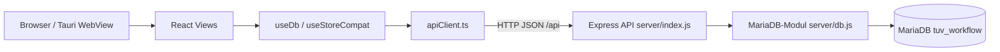
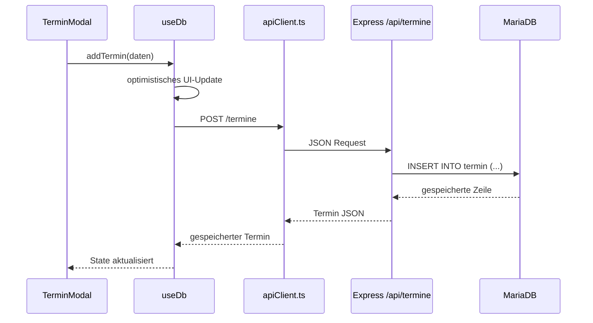
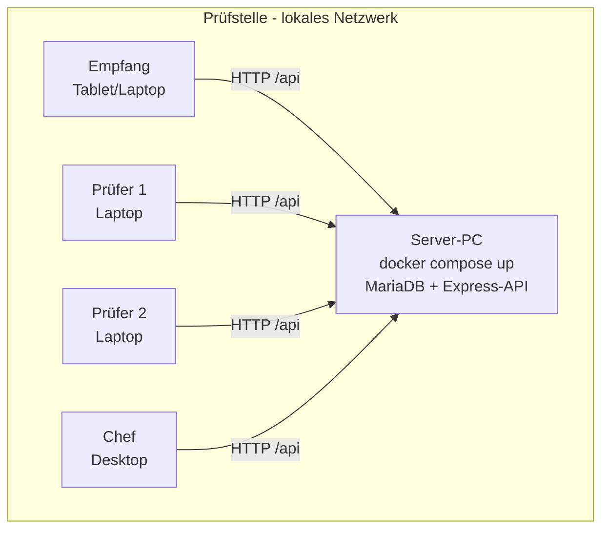

# Design-Dokumentation

Stand: 2026-05-17  
Aktuelle Architektur: React/Vite Frontend + Express API + MariaDB.

## 1. Zielbild

Die Anwendung trennt Benutzeroberflaeche, API und relationale Persistenz klar:

Der Browser enthaelt keine Datenbank-Engine. Alle dauerhaften Daten liegen in
MariaDB. Das Frontend bleibt dadurch leichtgewichtig und mehrere Clients koennen
denselben Datenstand nutzen.

## 2. Schichten

| Schicht | Dateien | Verantwortung |
|---|---|---|
| Präsentation | `src/views`, `src/features`, `src/components` | UI, Formulare, Tabellen, Modale, Charts |
| State/API-Client | `src/hooks/useDb.ts`, `src/hooks/useStoreCompat.ts`, `src/db/apiClient.ts` | React-State, optimistische Updates, HTTP-Aufrufe |
| Backend-API | `server/index.js` | REST-Endpunkte, Mapping camelCase/snake_case, Workflow-Regeln |
| Datenbank | `server/db.js`, MariaDB | Tabellen, Fremdschlüssel, Constraints, Stammdaten |

## 3. Datenfluss

Beispiel: Termin anlegen.

Nach Schreiboperationen aktualisiert `useDb` bei Bedarf die Listen erneut. Damit
bleibt die UI konsistent, ohne dass die Views SQL oder Datenbankdetails kennen.

## 4. API-Schnittstelle

Die API liegt unter `/api`:

| Methode | Pfad | Zweck |
|---|---|---|
| GET | `/api/health` | API-/DB-Verfuegbarkeit prüfen |
| GET/POST/PATCH/DELETE | `/api/halter` | Halter verwalten |
| GET/POST/PATCH/DELETE | `/api/fahrzeuge` | Fahrzeuge verwalten |
| GET/POST/PATCH/DELETE | `/api/termine` | Termine verwalten |
| PATCH | `/api/termine/:id/status` | Status mit WF-01-Prüfung setzen |
| GET | `/api/termine/:id/mängel` | Mängel eines Termins laden |
| POST/DELETE | `/api/mängel` | Mängel anlegen und löschen |
| POST | `/api/admin/reset` | Bewegungsdaten löschen |
| POST | `/api/admin/demo` | Demo-Daten neu laden |

`vite.config.js` proxyt lokale Frontend-Aufrufe von `/api` an
`http://127.0.0.1:8787`.

## 5. Datenbankdesign

MariaDB speichert acht Tabellen:

- `halter`
- `fahrzeug`
- `termin`
- `mangel`
- `status`
- `prüfart`
- `prüfer`
- `mangel_kategorie`

Die Tabellen sind in 3NF modelliert. Mängel sind nicht als Array im Termin
eingebettet, sondern eigene Zeilen mit Fremdschlüssel auf `termin`.

Wichtige Constraints:

- `fahrzeug.halter_id -> halter.halter_id`
- `termin.fahrzeug_id -> fahrzeug.fahrzeug_id` mit `ON DELETE CASCADE`
- `mangel.termin_id -> termin.termin_id` mit `ON DELETE CASCADE`
- eindeutiges Kennzeichen
- eindeutige FIN, sofern gesetzt
- CHECK auf Baujahr und Kilometerstand
- Stammdaten-FKs für Status, Prüfart, Prüfer und Mangelkategorie

## 6. Workflow-Regel WF-01

Ein Termin darf nicht auf `Bestanden` gesetzt werden, wenn ein nicht behobener
erheblicher Mangel (EM) oder gefährlicher Mangel (GfM) vorhanden ist (§ 29
StVZO). Die Regel wird dreifach abgesichert (Defense in Depth — siehe ADR-003):

1. **UI-Guard:** Status-Controls verhindern die Auswahl, wenn ein EM/GfM
   bekannt ist (`hatBlockierendenMangel()` in `src/utils/mangel.js`).
2. **API-Guard:** `/api/termine/:id/status` prüft in MariaDB per JOIN gegen
   `mangel_kategorie.blockiert_bestanden` und `mangel.behoben`.
3. **DB-Trigger:** `trg_termin_wf01_update` (`BEFORE UPDATE ON termin`) wirft
   `SIGNAL SQLSTATE '45000'`, falls die ersten zwei Schichten umgangen werden
   (z. B. direkter SQL-Client-Zugriff). Der zentrale Error-Handler in der
   Express-API mappt SQLSTATE 45000 auf HTTP 422 `{ok:false, reason}`.

Wenn ein nicht behobener blockierender Mangel zu einem bereits bestandenen
Termin angelegt wird, setzt die API den Termin automatisch auf
`Nicht bestanden` zurück.

## 7. Deployment

### Zielmodell: On-Premise pro Prüfstelle

Jede Prüfstelle betreibt einen eigenen Server-PC im internen Netzwerk.
Mitarbeiter (Empfang, Prüfer, Chef) verbinden sich vom jeweiligen Geraet
über das LAN/WLAN. Kundendaten verlassen die Werkstatt nicht.

### Drei Betriebsarten

| Modus | Zweck | Befehle |
|---|---|---|
| Entwicklung | Lokale Iteration | `docker compose up -d db`, `npm run dev:api`, `npm run dev` |
| Demo / Pilot | Voller Stack lokal | `docker compose up -d`, `npm run dev` |
| Produktion beim Kunden | On-Premise-Auslieferung | `docker compose up -d` plus statisch ausgeliefertes Frontend |

### Auslieferungs-Paket pro Kunde

- `docker-compose.yml`
- `.env`-Vorlage mit Kunden-spezifischen Werten
- `docs/backup.md` und Setup-Anleitung für Hetzner Storage Box
- Server-PC mit Docker und einer dedizierten zweiten Festplatte für Tier-2-Backups

### Sicherheitsgrenzen

- Keine Authentifizierung im Prototyp - das LAN gilt als vertrauenswuerdige Zone.
- Auth, HTTPS und Rollen kommen in einer Phase 2 (siehe Backlog US-12).
- MariaDB-Zugangsdaten liegen ausschließlich in `.env` auf dem Server.
- Frontend-Bundle enthaelt keine Datenbank-Credentials.
