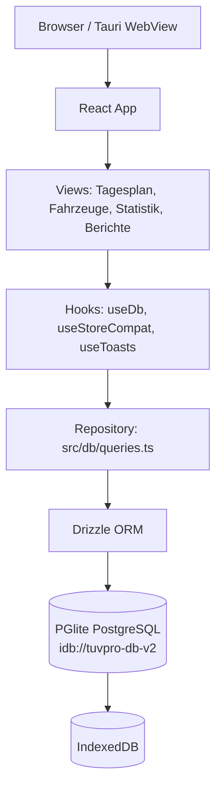
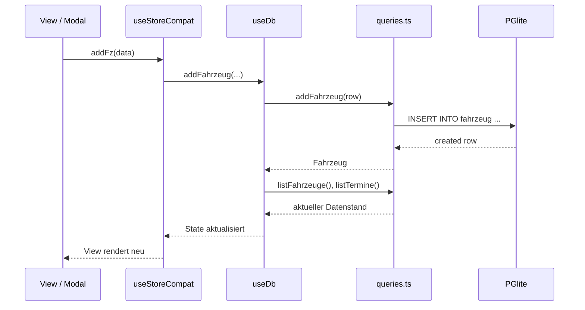

# Design — TÜV Prüfstelle Pro

Dieses Dokument beschreibt den aktuellen Architekturstand nach der Migration von
Firestore zu lokaler relationaler Persistenz mit PGlite und Drizzle ORM.

## 1. Architekturüberblick



Die App ist eine React/Vite-SPA. Es gibt keinen eigenen Backend-Server. Die
Datenbank läuft lokal im Browser über PGlite; PGlite persistiert die
PostgreSQL-kompatible Datenbank in IndexedDB. Firebase wird nur noch für
statisches Hosting verwendet.

## 2. Technologieentscheidungen

| Entscheidung | Alternative(n) | Begründung |
|---|---|---|
| React 19 + Vite | Next.js, Remix | SPA reicht aus; Vite liefert schnellen Entwicklungs-Workflow |
| PGlite | Firestore, SQLite, PostgreSQL-Server | Lokale relationale SQL-Datenbank ohne Backend |
| Drizzle ORM | Raw SQL, Prisma, Kysely | Typsichere Queries, PostgreSQL-Schema in TypeScript, SQL-Migrationen |
| Tauri 2 | Electron, reine Web-App | Kleine Desktop-Binary und späterer Pfad für lokale Geräteintegration |
| Recharts | Chart.js, D3 | React-nativ und ausreichend für die benötigten Diagramme |
| Repository-Pattern | Direct-Drizzle in Views | DB-Zugriff zentral testbar und refactor-sicher |

Die detaillierten Architekturentscheidungen stehen in `docs/decisions/`.

## 3. Modulstruktur

```txt
src/
  db/
    client.ts        PGlite- und Drizzle-Singleton
    schema.ts        Tabellen, Relationen und TypeScript-Typen
    migrate.ts       führt SQL-Migrationen beim App-Start aus
    seed.ts          Domänen- und Demo-Daten
    queries.ts       Repository-Schicht für CRUD und Aggregationen
    migrations/      SQL-Migrationsdateien
  hooks/
    useDb.ts         React-Hook für Datenbankzustand
    useStoreCompat.ts Adapter für bestehende View-API
  views/             fachliche Screens
  features/          Modals für Fahrzeug, Termin, Mangel
  components/        UI-Bausteine
  utils/             reine Hilfsfunktionen und Validatoren
```

Views greifen nicht direkt auf Drizzle oder PGlite zu. Der Zugriff läuft über
`useStoreCompat` beziehungsweise `useDb`, danach über `src/db/queries.ts`.

## 4. Datenfluss



Nach Schreiboperationen wird der relevante Datenbestand neu geladen. Damit
bleibt die UI konsistent, ohne Firestore-`onSnapshot` oder eigenen WebSocket.

## 5. Datenmodell

Das fachliche Datenmodell ist 3NF-normalisiert:

```txt
halter 1 -- N fahrzeug
fahrzeug 1 -- N termin
termin 1 -- N mangel
pruefart 1 -- N termin
pruefer 0..1 -- N termin
status 1 -- N termin
mangel_kategorie 1 -- N mangel
```

Das vollständige ER-Diagramm, Relationenschema, DDL und die
Integritätsbedingungen stehen in `docs/datenmodell.md`.

## 6. Business-Regeln

Die wichtigste Regel ist WF-01:

```txt
Ein Termin mit Hauptmangel oder gefährlichem Mangel darf nicht den Status
"Bestanden" erhalten.
```

Diese Regel wird auf mehreren Ebenen abgesichert:

- UI verhindert ungültige Statusauswahl.
- `useStoreCompat` erhält die Legacy-View-API und normalisiert Datenformen.
- `queries.ts` prüft Statuswechsel und Mangeländerungen zentral.
- Das relationale Schema verhindert verwaiste Datensätze per Foreign Keys.

## 7. Migrationen und Seed-Daten

Beim App-Start ruft `useDb` zuerst `runMigrations()` auf. Der Migrationsrunner
führt die SQL-Dateien aus `src/db/migrations/` genau einmal aus und protokolliert
dies in `__drizzle_migrations`.

Danach werden Domänentabellen idempotent befüllt:

```txt
status
pruefart
pruefer
mangel_kategorie
```

Wenn die Datenbank leer ist, lädt `seedDemoBestand()` Demo-Daten für Halter,
Fahrzeuge, Termine und Mängel.

## 8. Debugging

Im Dev-Modus installiert `src/db/debug.ts` einen kleinen Debug-Helfer:

```js
await tuvdb.table("fahrzeug")
await tuvdb.table("termin")
await tuvdb.sql("SELECT * FROM fahrzeug")
```

Die physische PGlite-Datenbank ist in Chrome unter folgendem Pfad sichtbar:

```txt
DevTools -> Application -> IndexedDB -> /pglite/tuvpro-db-v2
```

## 9. Deployment

Das Deployment baut statische Dateien in `dist/` und veröffentlicht sie über
Firebase Hosting. Firebase Hosting ist nur CDN/Static-File-Delivery; Firestore
wird nicht mehr als Datenbank verwendet.

